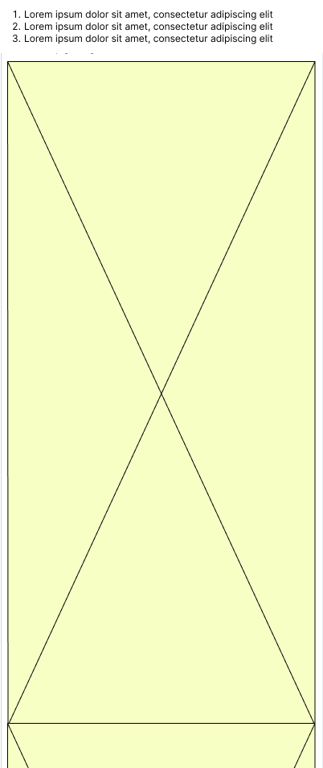
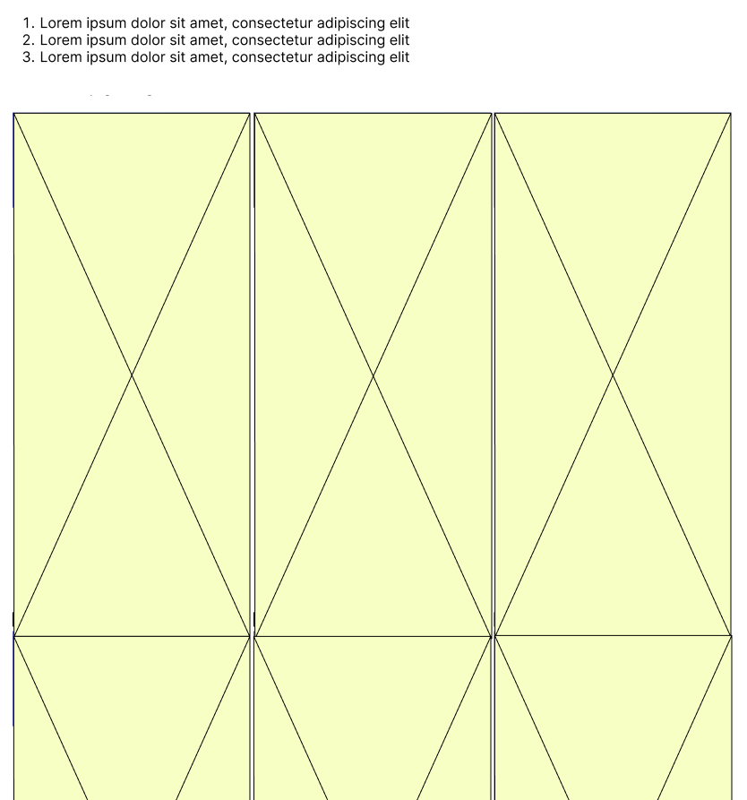

# 🛠️ Working with Pull Requests (PR)

## Code Review process

When it comes to code review process, let's aim to make it efficient and convenient for both the reviewer and the author of the Pull Request.

### Definition of Readiness

A Pull Request is considered as ready for code review when:

- All checkboxes in the pull request template are checked.
- A review is requested from a team member who ideally has sufficient knowledge about the specific topic, feature, or area. Feel free to involve multiple individuals in the review process.

### When Requesting a Review

1. **Preserve the PR Template:** First of all, do not remove the pull request template unless it's necessary. Stick to the current template by filling in the required details.

2. **Consider the Reviewer's Perspective:** When you submit your code for review, imagine yourself on the other side of the PR.

- Is your code ready to be reviewed?
- Are the needed details / clarifications provided in the description?
- Is the needed person's review requested?

3. **Keep Discussions within GitHub:** Prefer keeping the context inside the PR. E.g. minimize discussions around the code and the solution outside of GitHub.

Below you can find recommendations / requirements for the PR organization. These are must-to-follow rules and is applicable for every PR with a few exceptions.

### When Reviewing a PR

Let's not talk about obvious things like being polite, giving constructive feedback etc. As a reviewer:

- Ensure that the PR is ready to be reviewed before starting reviewing. Read the description to understand whether all conditions are met and review the code. Otherwise, request the author to update the missing details.
- If a code is unclear and makes you confused, consider requesting documenting unclear parts of the code. Either in the code itself or maybe in a dedicated playbook. It won't hurt to put links to Confluence / other PRs right in the code to make sure that anyone will be able to recollect what happened in the code. Well... In an ideal world.
  Remember: it's very easy to lose context or understanding of something that is not 100% obvious.
- When requesting a change, either generally or on specific lines, double check if your request is clear enough for another person to understand. Consider using [suggestions](https://stackoverflow.com/questions/60311158/how-can-i-suggest-multiple-lines-be-changed-in-markdown), attaching screenshots or links to make requests clearer.

## Branch name

The branch name must start with the conventional type (`feat` / `fix` etc), have the ticket number and the ticket name (in lower case) in it.

Example: a ticket you resolve is named `Introduce new kind of something` and the number is ABC-123. The branch name for a PR from the previous example must either be `feat/ABC-123-introduce-new-kind-of-something` or just `feat/ABC-123`.

## Commits

We are using conventional commits: https://www.conventionalcommits.org/en/v1.0.0/#summary
Please make sure your commits match the rules.

## Testing your changes first

Kindly test all the changes you've made in all possible scenarios:

- Different device sizes
- Different platforms
- Different connection states
- Etc.

Remember that some features work differently on different platforms, devices etc. For example, the `TextInputType.none` does not work on iOS and may lead to a crash / non-openable keyboard.

## Title naming convention (pay attention ⚠️)

### Why?

When we merge a PR into develop (or any other branch), we do `squash merging`. It's when all the commits of another branch are squashed into one commit, with the name usually set to the PR title.

_It is important to follow this naming convention as we have a script that parses the merged PR titles into a changelog when we release a new version._

### Title schema & rules

Here's a schema of the PR title: `{type}({tickets}): title`, where:

- `type` is the type of the conventional commit. For example, a new feature must be `feat`, while a bug fix must either be `bug` or `fix`.
- `tickets` (surrounded by `()`!) is/are the number(s) of the ticket(s) this PR resolves. Can either be one (`ABC-123`), or multiple, separated by comma (`ABC-123,ABC-322,ABC-100`).
  If a PR doesn't resolve any ticket (for example, it's a minor enhancement or a documentation update) it is okay to leave the PR title without the `{tickets}` part. Don't forget to remove the `()` brackets then.
- `title` usually is the ticket title. If the ticket resolves multiple tickets, use some common name, like `Login updates`. If the ticket doesn't resolve any tickets choose a title that describes the changes best.

Example: a ticket you resolve is named `Introduce new kind of something` and the number is ABC-123. The PR title must be: `feat(ABC-123): Introduce new kind of something`.

## Description

To make it simpler for those checking your work, please tell them about the changes you made and why you made them. It's essential to give a quick explanation because the reviewer might be dealing with a different project or a different scope and might not know much about your work.

If there is a ticket associated with your work, please include a link to it.

### Steps to test

If your works has complex or unclear steps to test, kindly provide those. Something like this would work:

1. Sign in as ...
2. Go to ...
3. Do ...
4. Expect ...

If it doesn't require any specific steps to test skip this part.

### Showcase: videos and screenshots

Adding videos and screenshots to your work helps reviewers understand what you're doing faster. It lets them see how things are going without having to open the app, catching any issues early on. This way, reviewers only start looking at the code when everything checks out in the videos or pictures. It's a straightforward way to make the review process quicker and easier. Keep in mind that the reviewer might be working in a very different context right now, so any information you provide will be useful.

In case some changes were requested, kindly attach a new video / screenshot, if required.

#### Why?

Switching to another branch, rerunning (possibly) code generation and launching / relaunching the app might be time consuming. If the change is minor, it is worth to provide the reviewer a visual representation of the change, so they won't even need to launch the app on their side to test it out.

### Add Screenshots in a better way

If you just drag & drop or upload a screenshot to Github, it will be formatted like this:

```markdown

```

Which will make the image expand to the max available width. Instead, we should add images like this:

```markdown
# Width is approximate but usually works just fine.


```

> 💡 Tip of the day!
>
> Consider adding an `img` [text replacement](https://support.apple.com/en-gb/guide/mac-help/mh35735/mac) to your MacOS settings!

Notice the difference between these two:

#### First formatting

Images are very large and cannot fit the normal screen size. In order to view a screenshot, you need to open it in a separate tab or zoom out the screen (just like it's done on the screenshot)


<p><em>Figure: Bad example of adding the screenshots</em></p>

#### Second formatting

Images are not large, even multiple images can be placed in one row next to each other (normal browser zoom).


<p><em>Figure: Good example of adding the screenshots</em></p>
